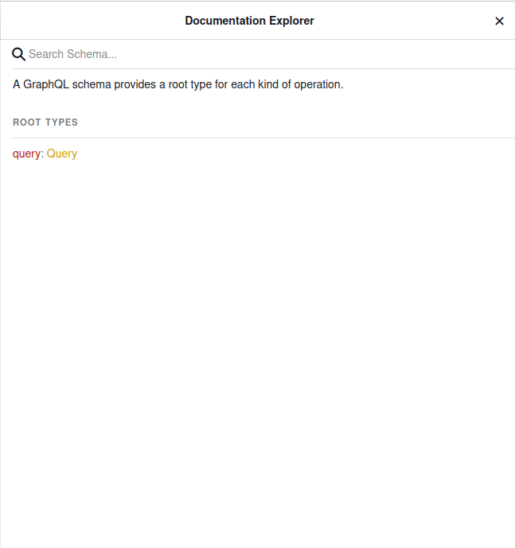
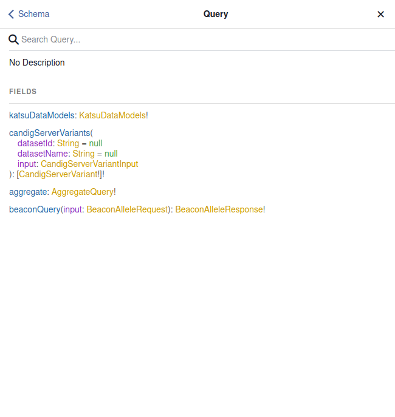
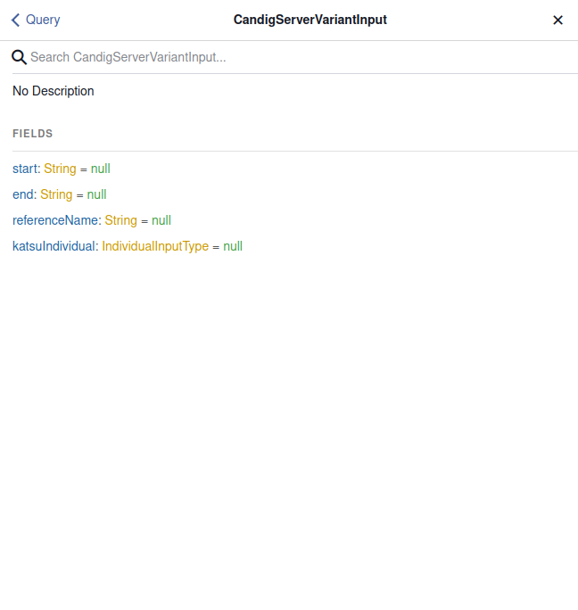
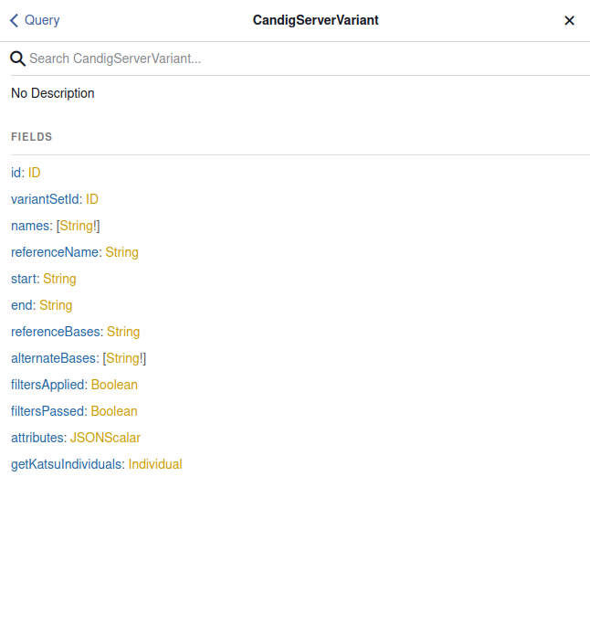
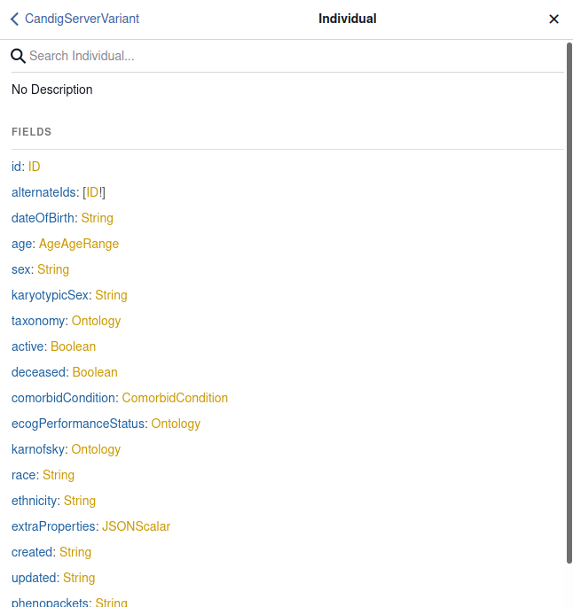

# Sample Queries

It is often difficult to fully understand why GraphQL may be required for a particular web application. For the CanDIG team, GraphQL's API allows for greater ability to perform complex-queries without over-&-underfetching data.

## Query Example 1:

> Find:
>
> - WHAT:
>   - Date of Birth
> - WHO:
>   - All Individuals
> - WHERE:
>   - Katsu Database
> - REQUIREMENTS:
>   - Individuals must have:
>     - A variant gene between the 712800th and 712900th positions of the 1st chromosome
>     - With a `T` reference base and a `C` alternate base

```python
# Query 1: Using REST API Endpoints

import time
from typing import Any, Dict
import aiohttp
import asyncio

CANDIG_SERVER = 'http://localhost:3000'
KATSU_API = 'http://localhost:8000/api'
DEFAULT_JSON = {
    "pageSize": 1000,
    "pageToken": "0"
}


def get_dataset_id(datasets: Dict[str, Any]) -> str:
    return datasets['results']['datasets'][2]['id'].strip()


def create_variant_search(dataset_id):
    return {
        "datasetId": dataset_id,
        "referenceName": "1",
        "start": "712800",
        "end": "712900",
        "pageSize": 1000,
        "pageToken": "0"
}


async def main():
    async with aiohttp.ClientSession() as session:
        async with session.post(f'{CANDIG_SERVER}/datasets/search', json=DEFAULT_JSON) as dataset_response:
            dataset = await dataset_response.json()

        dataset_id = get_dataset_id(dataset)

        async with session.post(f'{CANDIG_SERVER}/variants/search', json=create_variant_search(dataset_id)) as variants_response:
            variants = await variants_response.json()

        patients = []
        for variant in variants['results']['variants']:
            set_id = variant['variantSetId']

            async with session.get(f'{CANDIG_SERVER}/variantsets/{set_id}') as variant_set_response:
                variant_set_id = await variant_set_response.json()

            patient_id = variant_set_id['results']['patientId']

            async with session.get(f'{KATSU_API}/individuals/{patient_id}') as individual_response:
                individual = await individual_response.json()

            if 'T' == variant['referenceBases'] and 'C' in variant['alternateBases']:
                patients.append(individual['date_of_birth'])

        print(patients)


if __name__ == "__main__":
    t1 = time.time()
    asyncio.run(main())
    print(f'Execution took: {time.time() - t1}s')
```

```python
# Query 2: Using GraphQL Endpoint

import requests
import time
import json

GRAPHQL_ENDPOINT = 'http://localhost:7999/graphql'
DEFAULT_QUERY = '''
query {
  beaconQuery(input:{
    referenceName: "1",
    referenceBases: "T",
    alternateBases: "C",
    start: 712800,
    end: 712900
  }){individualsPresent{
    personalInfo{dateOfBirth}
  }}
}
'''


if __name__ == "__main__":
    t1 = time.time()
    response = requests.post(GRAPHQL_ENDPOINT, json={'query': DEFAULT_QUERY})
    individuals = json.loads(response.text)['data']['beaconQuery']['individualsPresent']
    print([individual['personalInfo']['dateOfBirth'] for individual in individuals])
    print(f'Execution took: {time.time() - t1}s')
```

What we find is that the REST API version of the code is significantly longer and requires the use of many more I/O requests, which requires complex asyncronous code. In contrast, the GraphQL version of the code is much more compact, and doesn't require the use of asyncronous code since there is only one endpoint and one single request we have to make. This reduces the development and testing time as well, since we get back exactly what we want from the endpoint, without having to worry about build requests like we would for the REST API. The Asyncronous calls are also handled by the GraphQL client itself, so the speed of requests is actually quite similar between the two.

### Query 1 Results Summary

| ENDPOINT | AVERAGE REQUEST LENGTH | CODE LENGTH |
| -------- | ---------------------- | ----------- |
| REST API | 0.18 seconds           | 60 Lines    |
| GRAPHQL  | 0.62 seconds           | 26 Lines    |

As can be seen, while the REST endpoints perform slightly better, the GraphQL endpoints also collect mCODE and phenopacket data at the same time. Thus for even larger queries, the GraphQL endpoint would not experience a decrease in performance whereas the REST endpoints would. The GraphQL code is also much shorter and on top of that, REST endpoints also have longer trial and error periods as we try to get the inputs and outputs for the endpoints to work, vs the minimal setup time for the GraphQL endpoint. Additionally, the load on memory is much lower with the GraphQL endpoint as I am not carrying around extra data that I have no use for after querying.

## Query Example 2: Querying Katsu

Through the previous example, the advantages of GraphQL over REST APIs are evident. So what kind of GraphQL queries are supported here? The first example we'll go through is querying the Katsu API for clinical MCode data. Please ensure that you already have the Synthea MCode data installed and ingested.

> Find:
>
> - WHAT:
>   - Sex
>   - Date Of Birth
>   - Race
> - WHO:
>   - All Individuals
> - WHERE:
>   - Katsu Database
> - REQUIREMENTS:
>   - Individuals must have:
>     - An MCODE Data Entry

For this following tasks, we will simply display the GraphQL query as the code to query in Python can just be reused from the first example.

```graphql
query getSubjectInfo {
  katsuDataModels {
    mcodeDataModels {
      mcodePackets {
        subject {
          sex
          dateOfBirth
          race
        }
      }
    }
  }
}
```

### Query 2 Results Summary

```graphql
{
  "data": {
    "katsuDataModels": {
      "mcodeDataModels": {
        "mcodePackets": [
          {
            "subject": {
              "sex": "MALE",
              "dateOfBirth": "1952-08-11",
              "race": null
            }
          },
          {
            "subject": {
              "sex": "FEMALE",
              "dateOfBirth": "1941-12-25",
              "race": null
            }
          },
          ...
        }
    }
}
```

We see that the GraphQL endpoint returned exactly what we wanted, nothing more and nothing less. It also has quite an easy syntax so one can understand the queries they are making without hassle. And for any fields that don't have values in the original database, GraphQL handles all errors and just returns null, like our `race` field. This allows us to be confident in our ability to perform queries without worrying about our program erroring out.

## Query Example 3: Querying CanDIG

The CanDIG Server stores variant records and we can access them just like we accessed the Katsu data.

> Find:
>
> - WHAT:
>   - referenceBases
>   - alternateBases
>   - dateOfBirth
>   - sex
>   - ethnnicity
> - WHO:
>   - All Individuals
> - WHERE:
>   - CanDIG V1 Server
> - REQUIREMENTS:
>   - Individuals must have:
>     - A variant gene between coordinates 945000 and 946000 of the first chromosome

```graphql
query canDIGSearch {
  candigServerVariants(
    input: { start: "945000", end: "946000", referenceName: "1" }
  ) {
    referenceBases
    alternateBases
    getKatsuIndividuals {
      dateOfBirth
      sex
      ethnicity
    }
  }
}
```

### Query 3 Results Summary

```graphql
{
    "data": {
        "candigServerVariants": [
        {
            "referenceBases": "C",
            "alternateBases": [
            "T"
            ],
            "getKatsuIndividuals": {
            "dateOfBirth": "1964-08-31",
            "sex": "FEMALE",
            "ethnicity": "Canadian"
            }
        },
        {
            "referenceBases": "C",
            "alternateBases": [
            "T"
            ],
            "getKatsuIndividuals": {
            "dateOfBirth": "1923-10-29",
            "sex": "FEMALE",
            "ethnicity": "Chinese"
            }
        },
      ...
    }
}
```

Note that a sample query for Beacon can be found in the first example provided.

## Query Example 4: Full Beacon Query

For this query, we will test the full Beacon specs by querying every field that can be returned by Beacon, and this will help us determine if there are any errors due to parsing or of the like within the GraphQL-interface.

To perform this query, simply return to the `projects` root directory and perform the following commands:

Note that you will need to have a `virtualenv` called `venv` already installed and set up with the requirements from the GraphQL-interface directory. If you already have one set up, please skip the next command block:

```bash
python3 -m venv venv
source venv/bin/activate
cd GraphQL-interface
pip install wheel pandas sklearn
pip install -r requirements.txt
cd ..
deactivate
```

The following steps will perform the query and output the status of the queries sent. Note that the last 5 queries should output a result stating that no variants could be found. Additionally, this query will take some time due to its large nature, and so don't worry if it takes a minute or two.

```bash
source venv/bin/activate
cd GraphQL-interface
python3 docs/samplequeries/test_examples.py
```

The inputs queries can be seen in the [Example Queries JSON File](samplequeries/example_inputs.json). The main GraphQL query that we will use is present in the [Example Query Python File](samplequeries/example_query.py), but be warned, it is quite long. Finally, the testing script can be found in the [test_examples.py](samplequeries/test_examples.py) file.

## Summary

It is thus evident that GraphQL makes complex queries within the Bioinformatics field much easier than the process would be with simple REST APIs. Additionally, the GraphQL client provided in this repository has a built-in UI called GraphiQL which will let you test the inputs and outputs you want to get, before delving into any code. It also allows you to view the GraphQL Documentation to see which fields you can access and what inputs a query might take, for example.

When generating GraphQL, we generally have either query objects or mutation object, similar to how GET and POST requests work for traditional APIs. However, we send all requests in GraphQL via POST requests and we specify the type of GraphQL object being sent via the key in the POST request.

A Query Object would look something like:

> ```python
> query = '''
> query {
>   objectToReturn(
>    potentialInput: {
>       inputField1: "string",
>       inputField2: "integer",
>       inputField3: "etc."
>     }
>   )
>   {
>     outputField1: "string",
>     outputField2: "integer",
>     outputField3: "object" {
>       outputField4: "string",
>       outputField5: "integer"
>     },
>     outputField6: "etc."
>   },
>   secondObjectToReturn(...){...},
>   thirdObjectToReturn(...){...}
> }
> '''
>
> requests.post(url, {"query": query})
> ```

For query objects, we simply specify which main objects we want to return, and then we specify any inputs that we want to pass to the API, if required. We finally specify all of the fields we want returned to us via the query and then we get our results. Looking at the Docs on GraphiQL makes the selection process much easier.

### Step-by-Step

Let's look through the GraphiQL service to generate a query of our own. For this example, we will generate the same query used in example 3 above.

This is the main Schema Documentation. We only have Query Objects defined for our current schema but if we defined a mutation object, it would be visible here as well.

> 

We get that we want to generate a query object, so we start by adding our query field to our GraphQL object. We will name our query canDIGSearch:

> ```graphql
> query canDigSearch {}
> ```

We will now click into the query object to see the fields it can return (or can take in as input).

> 

The Query Object shows us that it has several different objects in can output, from a `KatsuDataModel` object for our Katsu API to a `BeaconAlleleResponse` object for our Beacon V1 Service. We also see the specified inputs that we may need to input for the CanDIG Variant Service.

Since we want to return a Candig Variant Object, we will add that to our query, like so:

> ```graphql
> query canDIGSearch{
>  candigServerVariants(){}
> }
> ```

Note that the parantheses are used for input and curly braces for the output. Let's now click into the `CandigVariantServiceInput` object to see which fields we can input.

> 

The CanDIG Variant Input Documentation shows us that we can pass a maximum of 4 fields within a `CandigVariantServiceInput` object when querying; These include `referenceName, start, end, etc.` Now, we see that each of the fields has the format `fieldName: type = Base Value`. This means that if we don't fill in the fields, they will be assigned their default values. Often times we will need to specify fields as they are mandatory. We can determine which fields are necessary by looking to see their definition, since mandatory objects will be defined as `fieldName: type!`. The `!` next to the type lets us know that the field is mandatory.

We now modify our query to include the input fields we want to specify `(start=945000, end=946000, referenceName='1')`. We note that the name of the input field we want to specify is `input`, though we could also choose to specify the `datasetId` and/or `datasetName` if we so choose:

> ```graphql
> query canDIGSearch{
>   candigServerVariants(
>    input: {
>      start: "945000",
>      end: "946000",
>      referenceName:"1"
>    }
>  ){}
> }
> '''
> ```

Let's go back and see what kind of fields we can return from the CanDIG Variant Service.

> 

It is evident that there are a multitude of fields we can return, such as `id, variantSetId, referenceName, etc.` Some of these fields are basic types like `String`, but others are more complicated like `Individual`. GraphiQL allows us to view what fields we can return from complex objects like `Individual` as well, so let's try that.

> 

Thus we can see that the individual field contains subfields like `age, sex, dateOfBirth, etc.` that we can choose to return.

We now modify our query to include the output fields we want, namely `dateOfBirth, sex, ethnicity, referenceBases & alternateBases`. Note that since `dateOfBirth, sex & ethnicity` are fields of Individual, we have to specify that we are getting them from the `getKatsuIndividuals` field of `CandigServerVariant` as they are not fields of the `CandigServerVariant` itself.

> ```graphql
> query canDIGSearch {
>   candigServerVariants(
>     input: { start: "945000", end: "946000", referenceName: "1" }
>   ) {
>     referenceBases
>     alternateBases
>     getKatsuIndividuals {
>       dateOfBirth
>       sex
>       ethnicity
>     }
>   }
> }
> ```

We have now generated a query using GraphiQL! Beacon, Katsu and Aggregate Queries can be generated in the same way. In fact, you can test your queries in GraphiQL as well! Simply paste the query you generated into the laft-hand side of the Graphiql interface and run the editor with the play button! GraphiQL is a necessary tool for any developer working with GraphQL as it provides a simple, but powerful tool to test our queries, with great documentation generated directly from the code.

The Sample Python Code for the GraphQL and Rest APIs can be found within the [samplequeries](samplequeries/) folder

- [Sample Rest Query](samplequeries/sample_rest.py)
- [Sample GraphQL Query](samplequeries/sample_graphql.py)
